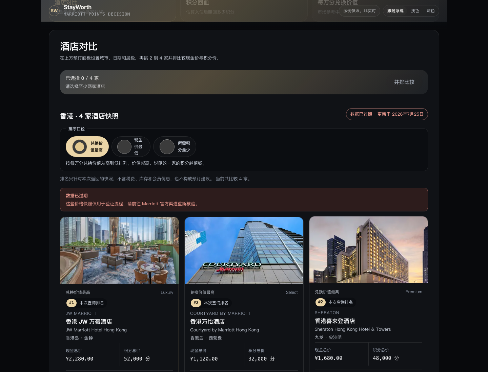
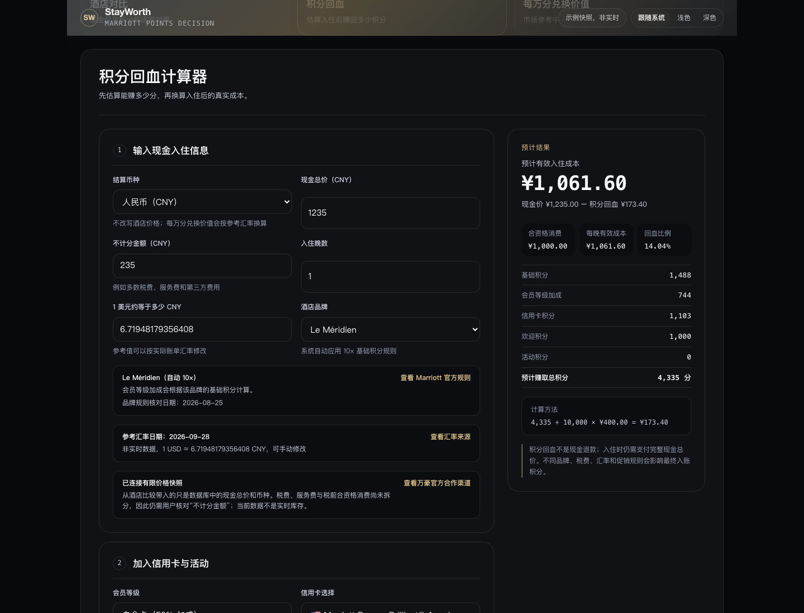
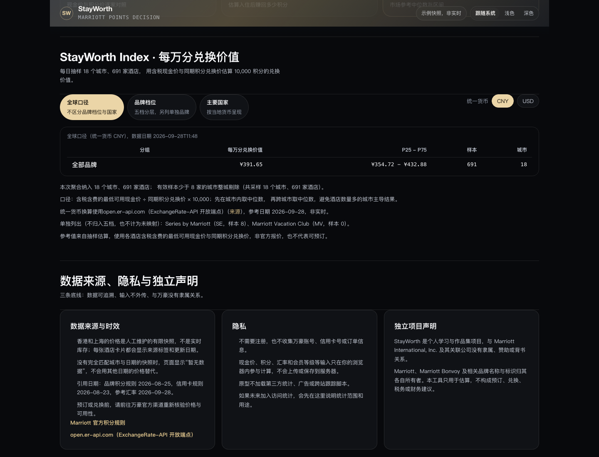

# 🏨 StayWorth

> Make every Marriott stay worth more. · 让每一次万豪住宿更值得。

**English** · [简体中文](#简体中文)

[](https://github.com/Yhxder/stayworth/actions/workflows/ci.yml)
[](#-project-board)
[](#-mvp-features)
[](#%EF%B8%8F-tech-stack)
[](#%EF%B8%8F-tech-stack)

StayWorth is a Marriott-focused decision tool for comparing cash rates,
award redemptions, and the true net cost of a paid stay. It is an independent
personal project built as a portfolio piece for internship and graduate-school
applications, and the prototype is live at
[stayworth.top](https://stayworth.top).

## 🖼️ Screenshots

Captured from the deployed site. The interface follows the system appearance by
default, and the header carries a three-state override (system / light / dark).

| Hero and booking panel | Hotel comparison |
| --- | --- |
|  |  |

| Points rebate calculator | Value per 10,000 points | Light appearance |
| --- | --- | --- |
|  |  |  |

Hotel photographs come from Marriott's official image library and are loaded
through this site's own proxy; they appear here only to illustrate the
interface. Prices in the captures are sample snapshots, not live inventory.

## ✨ MVP Features

### 01 · Hotel Comparison

Enter a city, travel dates, and a preferred Marriott brand tier—Luxury,
Premium, Select, Longer Stays, or Collections—to find matching hotels. Select
two to four hotels to review cash prices, points required, and redemption value
side by side, then send one paid-stay snapshot into the rebate calculator.
Results can be ranked by redemption value (cash value per 10,000 points), by
cash price, or by points required. Hotels with an identical primary metric share
a rank, and deterministic tie-breakers keep the same snapshot rendering the same
order. The interface states that the ranking covers only the snapshots returned
for the query and ignores taxes, availability, and member offers, so it never
claims to recommend a hotel.

### 02 · Points Rebate Calculator

Estimate the real cost of a paid stay using:

- Marriott membership tier
- Cash rate
- Base and elite bonus points
- Researched Marriott credit card selection for China, the U.S., and Canada
- Optional welcome or promotional points
- A custom cash value per 10,000 points

```text
Net stay cost = Cash price − (Points earned × Your value per point)
```

When a hotel snapshot is carried over from the comparison module, the calculator
also shows a market reference median from the StayWorth Index: city level first,
then country or region, then global. The panel always states which level it used,
the sample size, and the data date. It writes a value only after you press the
button, never overwrites what you typed, and stays hidden for manual entry with
no hotel context.

### 03 · StayWorth Index

A daily sample of representative Marriott hotels estimates what 10,000 Marriott
points are worth in cash. Each observation pairs the lowest available
tax-and-fee-inclusive cash rate with the same-period award rate for the same
hotel. Aggregation always takes the city median first and only then combines
cities, and the results are published as global, brand-tier, and country views.

- The published 2026-09-28 snapshot aggregates 18 cities and 691 hotel
  observations. The sampling panel behind it spans Asia, Oceania, Europe, the
  Middle East, and the Americas.
- Samples that cannot be mapped to one of the five brand tiers are excluded
  rather than guessed; Series by Marriott and Marriott Vacation Club are listed
  separately instead of being forced into a tier.
- The Index is a daily reference value, not the main data source. It cannot
  answer "is this specific hotel worth it this week," so the calculator still
  depends on the prices you provide.
- The daily sampling job is not part of this public repository. The site
  publishes the latest exported snapshot with each build, so a new sample becomes
  visible on the next deployment; a snapshot older than 48 hours is labelled as
  stale instead of being presented as current.

## 🛠️ Tech Stack

| Layer | Tools |
| --- | --- |
| Frontend | Next.js App Router, React 19, TypeScript, vinext/Vite |
| Styling | Tailwind CSS 4 |
| Edge API | Cloudflare Workers — finite hotel query endpoint |
| Database | Cloudflare D1 — cities, hotels, price snapshots, hotel catalogue, index samples, and dated exchange rates |
| Hosting | Cloudflare Workers on the `stayworth.top` custom domain, with the `workers.dev` address kept as a fallback |
| Testing | Node.js test runner (103 logic tests) and Playwright (22 Chromium tests) |
| Delivery | GitHub Actions — lint, logic tests, and browser tests on every push and pull request; deploy on `main` |
| Development | VS Code, Git |

## 📊 Project Board

| Milestone | Status |
| --- | :---: |
| Define the Marriott-only MVP | ✅ |
| Initialize the repository and product README | ✅ |
| Design the low-fidelity user flows and interface | ✅ |
| Build the points rebate calculator | ✅ |
| Refactor the frontend into focused components | ✅ |
| Build the finite D1 data layer and Worker API | ✅ |
| Connect the hotel UI to the Worker API | ✅ |
| Build hotel search against the D1 snapshot API | ✅ |
| Add side-by-side hotel comparison | ✅ |
| Rank hotels by redemption value | ✅ |
| Define the daily Marriott point-value methodology | ✅ |
| Build the StayWorth Index reference values | ✅ |
| Research and validate a live-data strategy | ✅ |
| Add automated tests and data-quality checks | ✅ |
| Add end-to-end tests for the core user flows | ✅ |
| Validate mobile, tablet, keyboard, and form accessibility | ✅ |
| Validate empty, API-error, and stale-data recovery flows | ✅ |
| Rebuild the interface on Apple HIG material and typography rules | ✅ |
| Serve every hotel photo through a site-owned image proxy | ✅ |
| Deploy the MVP to Cloudflare Workers | ✅ |
| Publish the MVP on a custom domain | ✅ |
| Refresh the published reference value automatically | ⬜ |
| Run real-user, screen-reader, and physical-device acceptance | ⬜ |

**Legend:** ✅ Complete · ⏳ In progress · ⬜ Planned

## 🎯 Product Principles

- **Explainable:** show the calculation behind every recommendation.
- **Comparable:** normalize cash rates and point prices before ranking.
- **Personalized:** let users choose their own point valuation and earning setup.
- **Trustworthy:** identify data sources, update times, and important limitations.

## 🗺️ Current Scope

The MVP supports Marriott only. Other hotel loyalty programs may be added after
the calculation model, data pipeline, and user experience are validated.

Live availability and pricing require an authorized source. Marriott's official
Affiliate/Partnerize program has been evaluated: joining is free and it provides
content feeds and tracked deep links, but it does not guarantee a free
real-time rate API, so prices stay on dated in-house snapshots. Third-party
reseller APIs are not used. The published reference values come from
low-frequency daily sampling, and that sampling job is kept outside this public
repository.

Exact city-and-date queries currently cover Hong Kong and Shanghai only. The
hotel catalogue in D1 holds 578 hotels across 38 Chinese cities for reference.
The product interface is Simplified Chinese today; only this repository's
documentation is bilingual.

The search form defaults to a stay one month in the future instead of a fixed
calendar date, so the first thing a new user sees is never a date that has
already passed. When a query has no snapshots, the empty state reports the
window the data does cover and offers a one-click search using those dates.

## 🗄️ Finite Data API

```text
GET /api/hotels?city=Hong%20Kong&checkIn=2026-08-15&checkOut=2026-08-16&tier=Premium
```

Successful records include currency, source, and update time. A valid query
without an exact snapshot returns `status: "empty"` and `message: "暂无数据"`.
Empty responses also carry `coverage`—the earliest stay window with snapshots
for that city, or `null` when the city itself has no data:

```json
{
  "status": "empty",
  "message": "暂无数据",
  "hotels": [],
  "coverage": { "checkIn": "2026-08-15", "checkOut": "2026-08-16" }
}
```

The frontend uses this endpoint for loading, success, empty, error, and stale
states. Selected paid-stay snapshots can prefill currency, total cash rate,
stay length, and brand in the points rebate calculator. Taxes and ineligible
spend are not inferred because the finite snapshots do not contain that split.

## 🔐 Data Sources, Privacy, and Independence

The prototype states its limits in the **数据来源、隐私与独立声明** section
rendered below the three modules:

- **Data sources and freshness.** Hong Kong and Shanghai prices are manually
  maintained snapshots, not live inventory. Every hotel card shows its source
  label and update date, and an uncovered city or date returns
  `status: "empty"` instead of substituting another date's rate. The interface
  also lists the reference dates for the Marriott brand earning rules, the
  credit-card rules, and the exchange rates, each linked to its official source.
- **Hotel photos.** Property photographs come from Marriott's official image
  library and are fetched through this site's own Worker proxy, which keeps the
  browser off the third-party CDN, sets a seven-day immutable cache, and serves
  width-limited WebP. They only show which property a row refers to.
- **Exchange rates.** The Index and the rebate calculator share one dated rate
  snapshot from the `open.er-api.com` open endpoint. Rates are explicitly
  non-real-time, and the fallback table is dated instead of being silently used
  as current.
- **Privacy.** There is no sign-up, and no Marriott account, card, or booking
  details are collected. The prototype loads no analytics, advertising, or
  cross-site tracking scripts. Cash price, points, exchange-rate, and
  membership inputs are calculated in the browser and are not uploaded or
  stored on the server. If analytics are added later, that notice is updated
  first.
- **Independence.** StayWorth is an independent personal project and is not
  affiliated with, endorsed by, or sponsored by Marriott International.
  Marriott and Marriott Bonvoy names and marks belong to their respective
  owners. The tool produces estimates only and is not booking, redemption,
  tax, or financial advice.

Production dependencies currently report no known advisories. The remaining
advisory reports come from the local build and test toolchain (`vite`,
`esbuild`, `wrangler`, and their transitive packages), which would need
breaking major upgrades; they are tracked as separate follow-up work instead
of being forced through `npm audit fix --force`.

## 🧪 Local Prototype

```bash
npm install
npm run dev
```

Open `http://localhost:3000` to use the prototype. Run `npm test`
to build the site, verify the calculation rules, and run the logic tests.

Every push to `main` and every pull request runs the same checks in GitHub
Actions (`.github/workflows/ci.yml`): lint, `npm test`, and `npm run test:e2e`.

Install Playwright's browser once, then run the core flows plus responsive,
keyboard, focus, form-error, empty-result, API-failure, and stale-data checks
in a real Chromium browser. The command applies local D1 migrations and starts
the site automatically:

```bash
npx playwright install chromium
npm run test:e2e
```

Failure screenshots, traces, videos, and the HTML report are written to ignored
local test folders and are not committed to GitHub. When browser tests fail in
CI, the report is uploaded as a workflow artifact.

## ☁️ Cloudflare Deployment

The prototype deploys to Cloudflare Workers with the existing `stayworth-mvp`
D1 database. The Worker serves the vinext App Router build together with the
static assets, and reads hotel snapshots from D1:

```bash
npx wrangler login          # once per machine
npm run cf:deploy           # build, then deploy with wrangler.deploy.jsonc
```

Useful companions:

```bash
npm run cf:deploy:dry-run   # package and validate without deploying
npm run cf:migrate:remote   # apply D1 migrations to the remote database
npm run cf:rows             # count cities, hotels, and price snapshots remotely
```

`wrangler.deploy.jsonc` points `main` at the built Worker
(`dist/server/index.js`), serves `dist/client` as Workers static assets, binds
`DB` to the production D1 database, and keeps both the custom domain and the
`workers.dev` address enabled. It is separate from `wrangler.local.jsonc`
(local development) and `wrangler.jsonc` (remote D1 migrations), so local
development, remote migrations, and production deployment stay independent.

The deploy job in `.github/workflows/ci.yml` runs only on `main` and stays
dormant until the repository has a `CLOUDFLARE_API_TOKEN` secret with the
**Workers Scripts: Edit** and **D1: Edit** permissions. Without that secret the
job logs a notice and skips, while lint, logic tests, and browser tests still
run on every push and pull request.

The current address is public unless Cloudflare Access is configured in front
of the Worker.

---

StayWorth is an independent personal project and is not affiliated with,
endorsed by, or sponsored by Marriott International.

---

# 简体中文

[English](#-stayworth) · **简体中文**

StayWorth 是一个专注万豪的住宿决策工具，用于对比现金价、积分兑换和付费入住的真实净成本。它是一个独立个人项目，作为实习与研究生申请的作品集，原型已上线：[stayworth.top](https://stayworth.top)。

## 🖼️ 界面截图

以下截图取自线上站点。界面默认跟随系统外观，页头提供「跟随系统 / 浅色 / 深色」三态覆盖。

| 首屏与预订面板 | 酒店对比 |
| --- | --- |
|  |  |

| 积分回血计算器 | 每万分兑换价值 | 浅色外观 |
| --- | --- | --- |
|  |  |  |

酒店图片来自万豪官方图库，经本站代理加载，仅用于展示界面；截图中的价格为示例快照，不是实时库存。

## ✨ MVP 功能

### 01 · 酒店对比

输入城市、入住退房日期和偏好的品牌档位（Luxury、Premium、Select、Longer Stays、Collections），找到对应酒店；选择 2–4 家后并排查看现金价、所需积分与兑换价值，并可把其中一条付费入住快照带入积分回血计算器。

结果可按兑换价值（每万分对应的现金价值，从高到低）、现金价或所需积分排序。主要指标相同则并列名次，并有确定性次级排序，保证同一批快照每次渲染顺序一致。界面会明确写出：排名只覆盖本次查询返回的快照，不考虑税费、可用性和会员优惠，因此它不构成“推荐某家酒店”的结论。

### 02 · 积分回血计算器

用以下输入估算付费入住的真实成本：

- 万豪会员等级
- 现金总价
- 基础积分与精英奖励积分
- 经核对的万豪信用卡（中国、美国、加拿大）
- 可选的欢迎积分或活动积分
- 自定义的每万分现金估值

```text
入住净成本 = 现金价 −（获得积分 × 你的每积分估值）
```

当从酒店对比带入一条快照时，计算器还会显示 StayWorth Index 的“市场参考中位数”，按城市口径 → 国家/地区口径 → 全球口径逐级回退，并始终标明所用口径、样本量与数据日期。只有点击按钮后才会写入数值，不会覆盖你已填的内容；手动输入、没有酒店上下文时完全不显示该区块。

### 03 · StayWorth Index（每万分兑换价值）

每天对代表性万豪酒店抽样，估算 10,000 积分的现金参考价值。每条观测把同一家酒店当期最低的含税含费现金价与同期积分兑换价配对。聚合顺序固定为“先取城市中位数、再跨城市合并”，结果按全球、品牌档位、国家三个视图展示。

- 当前已发布快照（2026-09-28）纳入 18 个城市、691 条酒店观测；背后的采样面板覆盖亚洲、大洋洲、欧洲、中东和美洲。
- 无法归入五个品牌档位中任何一档的样本会被剔除，而不是猜测归类；Series by Marriott 与 Marriott Vacation Club 单独列出。
- Index 只是每日参考值，不是主干数据源。它回答不了“我这周住这家酒店划不划算”，计算器仍然以你输入的价格为准。
- 每日采样任务不在这个公开仓库中。网站随每次构建发布最新的导出快照，因此新样本会在下一次部署后可见；超过 48 小时未更新的快照会明确标注过期，而不假装是最新数据。

## 🛠️ 技术栈

| 层次 | 工具 |
| --- | --- |
| 前端 | Next.js App Router、React 19、TypeScript、vinext/Vite |
| 样式 | Tailwind CSS 4 |
| 边缘接口 | Cloudflare Workers — 有限酒店查询接口 |
| 数据库 | Cloudflare D1 — 城市、酒店、价格快照、酒店目录、Index 样本与带日期的汇率 |
| 托管 | Cloudflare Workers，自有域名 `stayworth.top` 为主，`workers.dev` 地址作为备用 |
| 测试 | Node.js test runner（103 条逻辑测试）与 Playwright（22 条 Chromium 测试） |
| 交付 | GitHub Actions — 每次推送与 PR 跑 lint、逻辑测试和浏览器测试；`main` 分支通过后自动部署 |
| 开发 | VS Code、Git |

## 📊 项目进度

| 里程碑 | 状态 |
| --- | :---: |
| 确定“只做万豪”的 MVP 范围 | ✅ |
| 初始化仓库与产品 README | ✅ |
| 设计低保真用户流程与界面 | ✅ |
| 实现积分回血计算器 | ✅ |
| 把前端拆分为职责清晰的组件 | ✅ |
| 建立有限数据层 D1 与 Worker 接口 | ✅ |
| 让前端接入 Worker 接口 | ✅ |
| 基于 D1 快照实现酒店搜索 | ✅ |
| 增加并排酒店对比 | ✅ |
| 按兑换价值对酒店排名 | ✅ |
| 定义每万分兑换价值方法论 | ✅ |
| 实现 StayWorth Index 参考值 | ✅ |
| 调研并确定实时数据策略 | ✅ |
| 补齐自动化测试与数据质量检查 | ✅ |
| 为核心用户流程补端到端测试 | ✅ |
| 验证移动端、平板、键盘与表单可访问性 | ✅ |
| 验证暂无数据、接口失败、快照过期三类恢复流程 | ✅ |
| 按 Apple HIG 的材质与排版规则重构界面 | ✅ |
| 酒店图片全部改为经本站代理加载 | ✅ |
| 部署 MVP 到 Cloudflare Workers | ✅ |
| 用自有域名发布 MVP | ✅ |
| 让线上参考值自动更新 | ⬜ |
| 真实用户试用、屏幕阅读器与实体设备验收 | ⬜ |

**图例：** ✅ 已完成 · ⏳ 进行中 · ⬜ 计划中

## 🎯 产品原则

- **可解释：** 每个结论都展示计算过程。
- **可对比：** 排名前先统一现金价与积分价的口径。
- **个性化：** 积分估值与累积方式由用户决定。
- **值得信任：** 明确标注数据来源、更新时间和限制。

## 🗺️ 当前范围

MVP 只支持万豪。其他酒店忠诚计划会在计算模型、数据管道和用户体验验证之后再考虑。

实时房价与可用性必须来自授权来源。万豪官方联盟计划（Partnerize 运营）已评估：加入免费，并提供内容 feed 与带追踪的深链，但不承诺免费的实时房价接口，因此价格继续使用带日期的自有快照，不使用第三方转售接口。页面上的参考值来自低频每日采样，采样任务不放在这个公开仓库中。

目前精确的城市 + 日期查询只覆盖香港和上海；D1 中的酒店目录已收录中国 38 个城市的 578 家酒店，作为目录参考。**产品界面目前只有简体中文，这是本仓库唯一做成中英双语的部分。**

搜索表单默认查“今天 + 30 天”的一晚住宿，而不是固定日历日期，避免新用户一进来就看到已经过去的日期。当查询没有对应快照时，空状态会给出数据实际覆盖的日期窗口，并提供一键改用该日期重新查询。

## 🗄️ 有限数据接口

```text
GET /api/hotels?city=Hong%20Kong&checkIn=2026-08-15&checkOut=2026-08-16&tier=Premium
```

成功记录包含币种、来源与更新时间。合法查询但没有精确匹配的快照时，返回 `status: "empty"` 与 `message: "暂无数据"`。空结果同时带 `coverage`，即该城市最早有快照的入住窗口；城市本身没有数据时为 `null`：

```json
{
  "status": "empty",
  "message": "暂无数据",
  "hotels": [],
  "coverage": { "checkIn": "2026-08-15", "checkOut": "2026-08-16" }
}
```

前端的加载、成功、空结果、失败和过期五类状态都由这个接口驱动。选中的付费入住快照可以把币种、现金总价、入住晚数和品牌带入积分回血计算器。快照中没有税费与不计分金额的拆分，因此前端不会推测这两项。

## 🔐 数据来源、隐私与独立声明

原型在三个模块下方渲染 **数据来源、隐私与独立声明** 区块，明确写出边界：

- **数据来源与时效。** 香港与上海的价格是人工维护的快照，不是实时库存。每张酒店卡片都显示来源标签与更新日期；城市或日期没有覆盖时返回 `status: "empty"`，不会拿其他日期的价格替代。界面同时列出万豪品牌积分规则、信用卡规则与汇率的参考日期，并链接到各自官方来源。
- **汇率。** Index 与回血计算器共用同一份带日期的汇率快照，来源为 `open.er-api.com` 开放端点。汇率明确标注为非实时；兜底汇率表也带日期，不会被静默当作最新值。
- **酒店图片。** 酒店照片来自万豪官方图库，经本站 Worker 代理加载：浏览器不会直连第三方 CDN，代理层设置七天不可变缓存并按宽度输出 WebP。图片只用来标明这一行对应哪家酒店。
- **隐私。** 没有注册，也不收集万豪账号、银行卡或预订信息。原型不加载分析、广告或跨站追踪脚本。现金价、积分、汇率与会员等级等输入都在浏览器内计算，不上传、不存储到服务器。如果未来加入数据分析，会先更新这段声明。
- **独立项目。** StayWorth 是独立个人项目，与 Marriott International 无隶属、无背书、无赞助关系。Marriott 与 Marriott Bonvoy 的名称与商标归各自所有者。本工具只提供估算，不构成预订、兑换、税务或财务建议。

生产依赖当前没有已知安全通告。剩余通告全部来自本地构建与测试工具链（`vite`、`esbuild`、`wrangler` 及其传递依赖），需要跨大版本升级，因此单独跟踪，不用 `npm audit fix --force` 强行升级。

## 🧪 本地运行

```bash
npm install
npm run dev
```

打开 `http://localhost:3000` 即可使用原型。运行 `npm test` 会先构建站点，再验证计算规则并执行逻辑测试。

每次推送到 `main` 以及每个 Pull Request，都会在 GitHub Actions（`.github/workflows/ci.yml`）跑同一套检查：lint、`npm test`、`npm run test:e2e`。

首次安装 Playwright 浏览器后，可在真实 Chromium 中执行核心流程，以及响应式、键盘、焦点、表单错误、空结果、接口失败和过期数据检查。该命令会自动应用本地 D1 迁移并启动站点：

```bash
npx playwright install chromium
npm run test:e2e
```

失败截图、trace、录像和 HTML 报告写入本地被忽略的测试目录，不会提交到 GitHub；CI 中浏览器测试失败时，报告会作为工作流产物上传。

## ☁️ Cloudflare 部署

原型部署到 Cloudflare Workers，使用现成的 `stayworth-mvp` D1 数据库。Worker 同时提供 vinext App Router 构建产物与静态资源，并从 D1 读取酒店快照：

```bash
npx wrangler login          # 每台机器一次
npm run cf:deploy           # 构建后用 wrangler.deploy.jsonc 部署
```

常用配套命令：

```bash
npm run cf:deploy:dry-run   # 只打包校验，不真正部署
npm run cf:migrate:remote   # 把 D1 迁移应用到远程库
npm run cf:rows             # 统计远程城市、酒店与价格快照数量
```

`wrangler.deploy.jsonc` 把 `main` 指向构建后的 Worker（`dist/server/index.js`），把 `dist/client` 作为 Workers 静态资源，将 `DB` 绑定到生产 D1，并同时保留自有域名与 `workers.dev` 地址。它与 `wrangler.local.jsonc`（本地开发）和 `wrangler.jsonc`（远程 D1 迁移）分开，互不影响。

`.github/workflows/ci.yml` 中的 deploy 作业只在 `main` 分支运行；仓库里配置了具备 **Workers Scripts: Edit** 与 **D1: Edit** 权限的 `CLOUDFLARE_API_TOKEN` 后才会真正部署，没有该密钥时会打印提示并跳过，lint、逻辑测试和浏览器测试照常执行。

除非在 Worker 前面配置 Cloudflare Access，当前地址是公开的。

---

StayWorth 是独立个人项目，与 Marriott International 无隶属、无背书、无赞助关系。

[↑ 返回英文版 / Back to English](#-stayworth)
